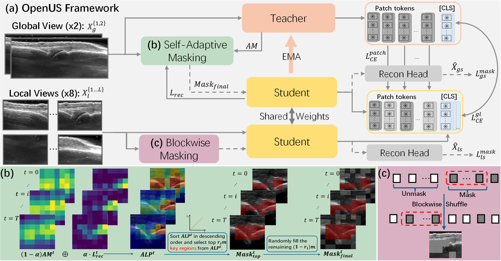
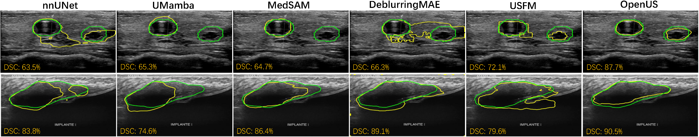
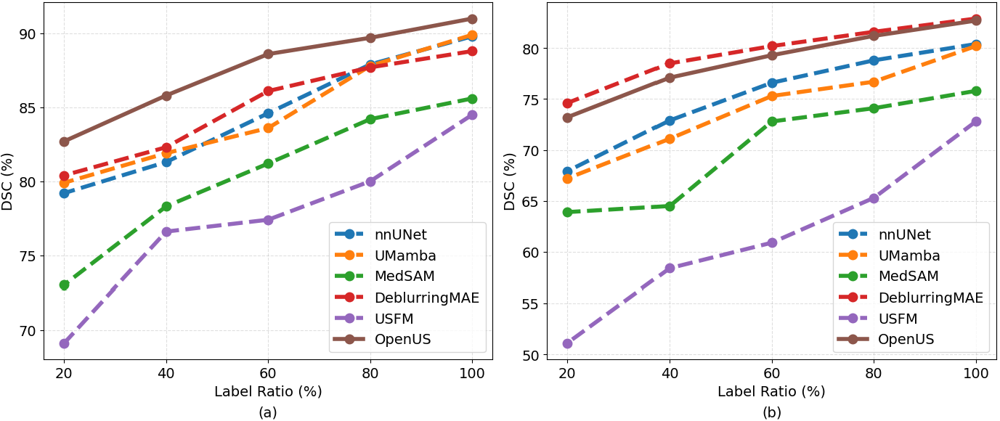

# OpenUS
OpenUS: A Fully Open-Source Foundation Model for Ultrasound Image Analysis via Self-Adaptive Masked Contrastive Learning

Pre-train a general-purpose ultrasound representation with our recipe, then fine‑tune or evaluate on classification and segmentation tasks with a few commands.

<p align="center">
  <a href="#Overview">Overview</a> •
  <a href="#installation">Installation</a> •
  <a href="#dataset-preparation">Dataset Preparation</a> •
  <a href="#pre-training">Pre-training</a> •
  <a href="#downstream-tasks">Downstream Tasks</a> •
  <a href="#results">Results</a> •
  <a href="#citation">Citation</a> 
</p>

<p align="center">
  
  
  
  
  
</p>

---

## Overview

This repository contains the code for our paper:  
 
[[Paper on arXiv](https://www.arxiv.org/abs/2511.11510)]



- **Foundation pre-training** for ultrasound images using self‑adaptive masked contrastive learning.
- **Plug‑and‑play backbones** (e.g., `vmamba_small`) with optional pretrained V‑Mamba weights.
- **Ready‑to‑use evaluation** for **classification** (e.g., *Fetal Planes*, *BUSI*) and **segmentation** (e.g., *TN3K*, *BUSBRA*).

---

## Installation

**Requirements**

- Python **3.10**
- PyTorch **2.2** with CUDA 12.x (recommended)
- Linux or WSL2 (Windows)
- Optional: a Weights & Biases account for logging

```bash
conda create -n openus python=3.10 -y
conda activate openus

pip install torch==2.2 torchvision torchaudio triton pytest chardet yacs termcolor fvcore seaborn packaging ninja einops numpy==1.24.4 timm==0.4.12

# Optional V‑Mamba dependency if you plan to use vmamba_small
pip install https://github.com/state-spaces/mamba/releases/download/v2.2.4/mamba_ssm-2.2.4+cu12torch2.2cxx11abiTRUE-cp310-cp310-linux_x86_64.whl
```

---

## Dataset Preparation

This repository supports both **pre‑training** and **downstream** evaluation datasets.

### Pre‑training datasets

Prepare your ultrasound pre‑training corpus as an image directory or list of directories. Common formats:
- Flat folder of images (e.g., `.png`, `.jpg`).
- Folder of patient/study subfolders containing frames.

Pass root paths via your launcher or configuration (see `--output_dir`, `--train_num`, and dataset args in your script). Ensure your transforms/loader in `main_openus.py` point to these directories.


### Evaluation datasets

| Task | Dataset | Example Arg(s) |
|---|---|---|
| Classification | `fetal_planes` | `--dataset fetal_planes --num_labels 6 --data_path <DATASET_ROOT>` |
| Classification | `busi` | `--dataset busi --num_labels 3 --data_path <DATASET_ROOT>` |
| Segmentation | `TN3K` | `--dataset_name TN3K --data_root <ROOT> --data_root2 <ALT_ROOT> --json_file <META.json>` |
| Segmentation | `BUSBRA` | `--dataset_name BUSBRA --data_root <ROOT> --json_file <META.json>` |

> **Tip**: Keep a consistent directory structure and use absolute paths for reproducibility.

### OpenUS pre-training and validation datasets (We shall continue to expand the dataset for pre-training....)

<details>
  <summary><strong>Datasets Summary</strong> (click to expand)</summary>

| Dataset                  |   size | Task                         | Body Part                                                            | Link                                                                                                     |
|:-------------------------|-------:|:-----------------------------|:---------------------------------------------------------------------|:---------------------------------------------------------------------------------------------------------|
| 105US                    |    105 | Segmentation                 | Liver                                                                | [link](https://www.researchgate.net/publication/329586355_100_2D_US_Images_and_Tumor_Segmentation_Masks) |
| AbdomenUS                |    617 | Segmentation                 | Abdomen                                                              | [link](https://www.kaggle.com/datasets/ignaciorlando/ussimandsegm)                                       |
| ACOUSLIC                 |   6620 | Segmentation                 | Abdomen                                                              | [link](https://acouslic-ai.grand-challenge.org/overview-and-goals/)                                      |
| ASUS                     |   2865 | Segmentation                 | Abdomen                                                              | [link](https://github.com/SlicerIGT/aigt)                                                                |
| AUL                      |    735 | classification, segmentation | Liver                                                                | [link](https://zenodo.org/records/7272660)                                                               |
| brachial plexus          |  40788 | Segmentation                 | Nerve                                                                | [link](https://github.com/Regional-US/brachial_plexus)                                                   |
| BrEaST                   |    252 | classification, segmentation | Breast                                                               | [link](https://www.cancerimagingarchive.net/collection/breast-lesions-usg/)                              |
| BUID                     |    232 | classification, segmentation | Breast                                                               | [link](https://data.mendeley.com/datasets/3ksd7w7jkx/1)                                                  |
| BUS_UC                   |    810 | classification, segmentation | Breast                                                               | [link](https://data.mendeley.com/datasets/3ksd7w7jkx/1)                                                  |
| BUS_UCML                 |    264 | Segmentation                 | Breast                                                               | [link](https://data.mendeley.com/datasets/7fvgj4jsp7/1)                                                  |
| BUS-BRA                  |   1875 | classification, segmentation | Breast                                                               | [link](https://github.com/wgomezf/BUS-BRA)                                                               |
| BUS_Dataset_B            |    163 | classification, segmentation | Breast                                                               | [link](https://helward.mmu.ac.uk/STAFF/M.Yap/dataset.php)                                                |
| BUSI                     |   1560 | classification, segmentation | Breast                                                               | [link](https://scholar.cu.edu.eg/?q=afahmy/pages/dataset)                                                |
| CAMUS                    |  19232 | Segmentation                 | Cardiac                                                              | [link](https://humanheart-project.creatis.insa-lyon.fr/database/#collection/6373703d73e9f0047faa1bc8g)   |
| CCAUI                    |   1100 | Segmentation                 | Echocardiogram                                                       | [link](https://data.mendeley.com/datasets/d4xt63mgjm/1)                                                  |
| DDTI                     |    637 | Segmentation                 | Thyroid                                                              | [link](https://github.com/openmedlab/Awesome-Medical-Dataset/blob/main/resources/TN3K.md)                |
| EchoNet-Dynamic          |  20048 | Segmentation                 | Echocardiogram                                                       | [link](https://github.com/echonet/dynamic)                                                               |
| EchoNet-Pediatric        |  15450 | Segmentation                 | Echocardiogram                                                       | [link](https://echonet.github.io/pediatric/)                                                             |
| FALLMUD                  |    813 | Segmentation                 | Muscle                                                               | [link](https://kalisteo.cea.fr/index.php/fallmud/#)                                                      |
| FASS                     |   1588 | Segmentation                 | Fetal Abdomen                                                        | [link](https://data.mendeley.com/datasets/4gcpm9dsc3/1)                                                  |
| Fast-U-Net               |   1411 | Segmentation                 | Abdominal Circumferenc and Head Circumference       | [link](https://github.com/vahidashkani/Fast-U-Net)                                                       |
| GIST514-DB(usd514)       |  43656 | Segmentation                 | Gastrointestinal Stromal Tumour                                      | [link](https://github.com/howardchina/query2)                                                            |
| HC                       |   1334 | Segmentation                 | Fetal Head                                                           | [link](https://hc18.grand-challenge.org/)                                                                |
| kidneyUS                 |    487 | Segmentation                 | Kidney                                                               | [link](https://github.com/rsingla92/kidneyUS)                                                            |
| LUSS_phantom (LUS_model) |    564 | Segmentation                 | Lung                                                                 | [link](https://archive.researchdata.leeds.ac.uk/1263/)                                                   |
| MicroSeg                 |   1931 | Segmentation                 | Prostate                      | [link](https://zenodo.org/records/10475293)                                                              |
| MMOTU-2D                 |   1469 | Segmentation                 | Ovarian Tumor                                                        | [link](https://github.com/cv516Buaa/MMOTU_DS2Net)                                                        |
| MMOTU-3D                 |    170 | Segmentation                 | Ovarian Tumor                                                        | [link](https://github.com/cv516Buaa/MMOTU_DS2Net)                                                        |
| regPro                   |   4706 | Segmentation                 | Prostate Ultrasound                                                  | [link](https://muregpro.github.io/data.html)                                                             |
| S1                       |    201 | Segmentation                 | Breast                                                               | [link](https://pmc.ncbi.nlm.nih.gov/articles/PMC8205136/)                                                |
| Segthy                   |  12737 | Segmentation                 | Thyroid                                                              | [link](https://www.cs.cit.tum.de/camp/publications/segthy-dataset/)                                      |
| STMUS_NDA                |   4355 | classification, segmentation | Transverse Musculoskeletal                                           | [link](https://data.mendeley.com/datasets/3jykz7wz8d/1)                                                  |
| STU-Hospital             |     42 | Segmentation                 | Breast                                                               | [link](https://github.com/xbhlk/STU-Hospital)                                                            |
| TG3K                     |   3585 | Segmentation                 | Thyriod                                                              | [link](https://github.com/openmedlab/Awesome-Medical-Dataset/blob/main/resources/TN3K.md)                |
| Thyroid US Cineclip      |  17412 | Segmentation                 | Thyriod                                                              | [link](https://stanfordaimi.azurewebsites.net/datasets/a72f2b02-7b53-4c5d-963c-d7253220bfd5)             |
| TN3K                     |   3493 | Segmentation                 | Thyriod                                                              | [link](https://github.com/openmedlab/Awesome-Medical-Dataset/blob/main/resources/TN3K.md)                |
| UPBD                     |    955 | Segmentation                 | Brachial Plexus                                                      | [link](https://ubpd.worldwidetracing.com:9443/)                                                          |
| US nerve Segmentation    |  11134 | Segmentation                 | Nerve                                                                | [link](https://www.kaggle.com/c/ultrasound-nerve-segmentation/data)                                      |
| USAnotAI                 |    366 | classification               | Anatomical Regions                                                   | [link](https://github.com/ftsvd/USAnotAI)                                                                |
| Cactus                   |  37736 | classification               | Cardiac                                                              | [link](https://github.com/coding-groot/cactus)                                                           |
| IUGC25                   |  33466 | landmark detection           | Fetal Head                                                           | [link](https://www.codabench.org/competitions/9735/#/phases-tab)                                         |
| Fetal_Planes_DB          |  12400 | classification               | All Fetal Body Part | [link](https://zenodo.org/records/3904280)                                                               |


</details>

---

## Pre-training

The command below launches pre‑training with the `vmamba_small` backbone. Adjust paths and parameters as needed.

### Multi-GPU pre-training:

```bash
torchrun --nproc_per_node=4     
        --master_addr=127.0.0.1
        --master_port=29501    
        main_openus.py          
        --arch vmamba_small     
        --patch_size 4          
        --batch_size_per_gpu 32 
        --num_workers 8         
        --train_num 1            
        --pretrained_vmamba True   
        --output_dir <OUTPUT_DIR>   
        --global_crops_scale 0.14 1.0   
        --masking_ratio 0.60 
        --local_rec_loss True 
        --global_rec_loss True 
        --student_feedback True 
        --adaptive_weighting True 
        --alpha_init 0.1 
        --alpha_final 0.9 
        --alpha_schedule 'cosine' 
        --enable_wandb True   
        --wandb_name <RUN_NAME>     
        --load_from <OPTIONAL_CHECKPOINT_OR_EMPTY>   
        --epochs 151
```

### Pre-training weights will release soon...

## Downstream Tasks

### 1) Classification

Supported example datasets: **`fetal_planes`** (6 classes) and **`busi`** (3 classes).

```bash
python eval_linear.py   
    --arch vmamba_small   
    --num_labels 6                   # use 3 for 'busi'
    --dataset fetal_planes           # or 'busi'
    --data_path <DATASET_ROOT>   
    --pretrained_weights <CKPT_OR_None>   
    --output_dir <OUTPUT_DIR>   
    --log_name <RUN_NAME>   
    --avgpool_patchtokens 2   
    --lr 0.001   
    --pretrained_vmamba True
```

### 2) Segmentation

Supported example datasets: **`TN3K`** and **`BUSBRA`**.

```bash
python eval_segmentation.py   
  --arch vmamba_small   
  --dataset_name TN3K                 # or 'BUSBRA'
  --data_root <DATA_ROOT>   
  --data_root2 <OPTIONAL_SECOND_ROOT>   
  --json_file <METADATA_JSON>   
  --pretrained_vmamba True   
  --pretrained_weights <CKPT_PATH>   
  --output_dir <OUTPUT_DIR>   
  --log_name <RUN_NAME>   
  --lr 0.001
```

## Fine-tune in your custom dataset

### 1) Classification

```bash
python eval_linear.py   
    --arch vmamba_small   
    --num_labels <.>                   
    --dataset <Custom Dataset>          
    --data_path <DATASET_ROOT>   
    --pretrained_weights <Pre-trained_OpenUS_CKPT_PATH>   
    --output_dir <OUTPUT_DIR>   
    --log_name <RUN_NAME>   
    --avgpool_patchtokens <.>   
    --lr <.>   
    --pretrained_vmamba True
```

### 2) Segmentation

```bash
python eval_segmentation.py   
  --arch vmamba_small   
  --dataset_name <Custom Dataset>                  
  --data_root <DATA_ROOT>   
  --data_root2 <OPTIONAL_SECOND_ROOT>   
  --json_file <METADATA_JSON>   
  --pretrained_vmamba True   
  --pretrained_weights <Pre-trained_OpenUS_CKPT_PATH>   
  --output_dir <OUTPUT_DIR>   
  --log_name <RUN_NAME>   
  --lr <.>
```

---

## Results
Pre-trained `OpenUS` model can be easily adapted to specific downstream tasks by serving as a backbone for label-efficient fine-tuning.

*Visualization of US segmentation results on [TN3K](https://github.com/openmedlab/Awesome-Medical-Dataset/blob/main/resources/TN3K.md) and [BUS-BRA](https://github.com/wgomezf/BUS-BRA). The ground truth is depicted in green, and the prediction is shown in yellow.*



*Label efficiency experiments of the downstream segmentation tasks: (a) [BUS-BRA](https://github.com/wgomezf/BUS-BRA) and (b) [TN3K](https://github.com/openmedlab/Awesome-Medical-Dataset/blob/main/resources/TN3K.md).*



### Classification task
| Model | Backbone   |Dataset |ACC(%)| F1(%) | Weight Link     |
|-------|------------|------|--------|-------|-----------------|
| OpenUS| VMamba-S|[Fetal Planes](https://zenodo.org/records/3904280) |90.3±0.4 | 89.4±0.3 | [OpenUS]()|
| OpenUS| VMamba-S|[BUSI](https://scholar.cu.edu.eg/?q=afahmy/pages/dataset) |87.8±0.4 | 86.3±0.3 | [OpenUS]()|


### Segmentation task
| Model | Backbone   |Dataset |DSC(%)| IoU(%) | Weight Link     |
|-------|------------|------|--------|-------|-----------------|
| OpenUS| VMamba-S|[BUS-BRA](https://github.com/wgomezf/BUS-BRA) |91.0±0.9 | 83.5±1.0  | [OpenUS]()|
| OpenUS| VMamba-S|[TN3K](https://github.com/openmedlab/Awesome-Medical-Dataset/blob/main/resources/TN3K.md) |82.7±1.2 | 73.1±1.1 | [OpenUS]()|

---
## Citation

If you find this repository helpful for your research, please consider citing our work:

```bibtex
@misc{zheng2025openusfullyopensourcefoundation,
      title={OpenUS: A Fully Open-Source Foundation Model for Ultrasound Image Analysis via Self-Adaptive Masked Contrastive Learning}, 
      author={Xiaoyu Zheng and Xu Chen and Awais Rauf and Qifan Fu and Benedetta Monosi and Felice Rivellese and Myles J. Lewis and Shaogang Gong and Gregory Slabaugh},
      year={2025},
      eprint={2511.11510},
      archivePrefix={arXiv},
      primaryClass={cs.CV},
      url={https://arxiv.org/abs/2511.11510}, 
}
```